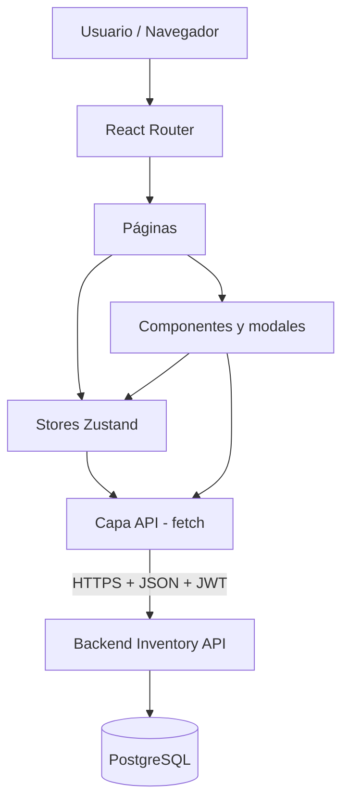
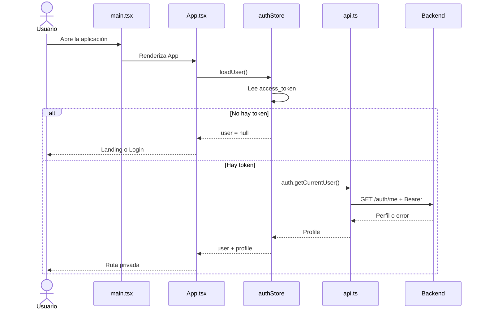
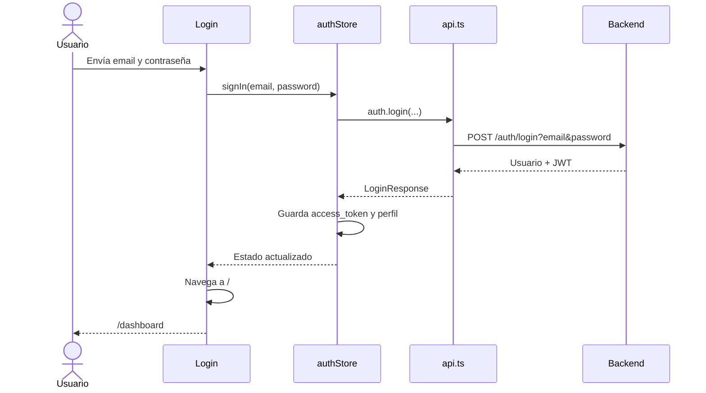
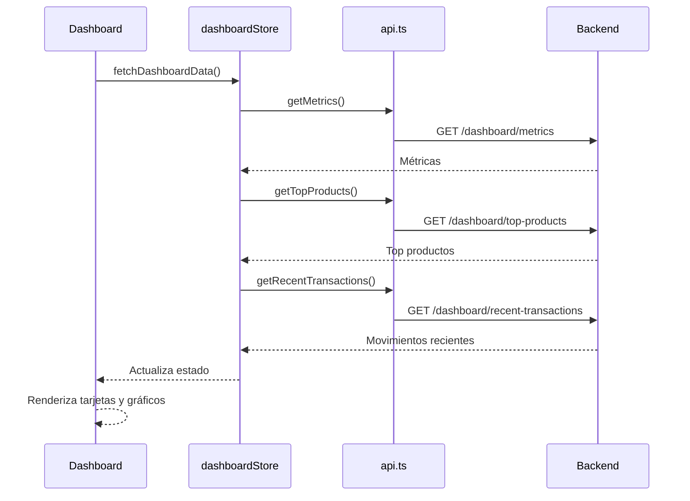
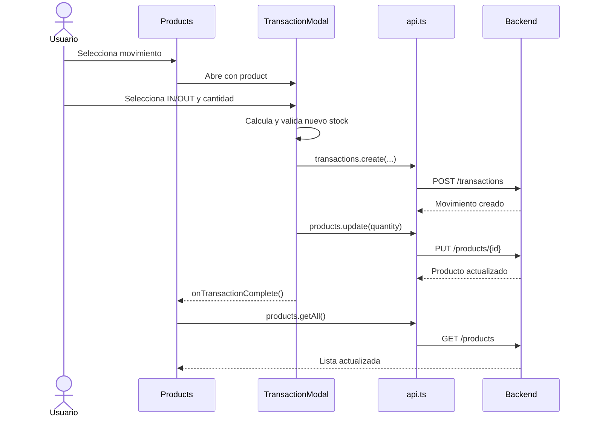

# InventoryPro - Frontend

Frontend web del sistema de gestión de inventario **InventoryPro**. La aplicación permite registrarse, iniciar sesión, consultar métricas, visualizar gráficos, administrar productos y registrar entradas o salidas de existencias.

Repositorio: <https://github.com/omalblanto/inventory-fe>

## Contenido

- [Tecnologías](#tecnologías)
- [Arquitectura](#arquitectura)
- [Estructura del repositorio](#estructura-del-repositorio)
- [Descripción de los directorios](#descripción-de-los-directorios)
- [Descripción de cada archivo](#descripción-de-cada-archivo)
- [Rutas de navegación](#rutas-de-navegación)
- [Flujo de llamadas](#flujo-de-llamadas)
- [Integración con el backend](#integración-con-el-backend)
- [Instalación](#instalación)
- [Docker y Nginx](#docker-y-nginx)
- [Hallazgos técnicos](#hallazgos-técnicos)

## Tecnologías

| Tecnología | Función |
| --- | --- |
| React 18 | Construcción de la interfaz mediante componentes |
| TypeScript | Tipado estático del frontend |
| Vite 5 | Desarrollo, compilación y previsualización |
| React Router 6 | Navegación y protección de rutas |
| Zustand | Estado global de autenticación y dashboard |
| Tailwind CSS | Estilos y diseño responsivo |
| Chart.js / react-chartjs-2 | Gráficos del dashboard |
| Lucide React | Iconografía |
| Fetch API | Comunicación HTTP con el backend |
| Docker | Ejecución del servidor de desarrollo en contenedor |
| Nginx | Configuración disponible para servir una SPA compilada |

> `@supabase/supabase-js` aparece como dependencia, pero el código actual consume un backend REST propio y no importa el cliente de Supabase.

## Arquitectura

La aplicación sigue una organización por capas: las páginas componen la experiencia; los componentes encapsulan piezas reutilizables; los stores coordinan el estado global; `api.ts` concentra las llamadas HTTP; y el backend conserva los datos.



### Responsabilidad de cada capa

| Capa | Archivos | Responsabilidad |
| --- | --- | --- |
| Arranque | `index.html`, `src/main.tsx` | Crear el punto de montaje y renderizar React |
| Enrutamiento | `src/App.tsx` | Definir rutas públicas, privadas y redirecciones |
| Páginas | `src/pages/*` | Construir cada pantalla y coordinar casos de uso |
| Componentes | `src/components/*` | Layout y formularios modales reutilizables |
| Estado | `src/store/*` | Sesión, perfil y datos del dashboard |
| Integración | `src/lib/api.ts` | URL del backend, JWT, solicitudes y errores |
| Tipos | `src/types/database.ts` | Contratos TypeScript del dominio |
| Presentación | `src/index.css`, Tailwind | Estilos globales y utilidades visuales |
| Build/operación | Vite, TypeScript, Docker, Nginx | Compilación, calidad y despliegue |

## Estructura del repositorio

```text
inventory-fe/
├── src/
│   ├── components/
│   │   ├── AddProductModal.tsx
│   │   ├── EditProductModal.tsx
│   │   ├── Layout.tsx
│   │   └── TransactionModal.tsx
│   ├── lib/
│   │   └── api.ts
│   ├── pages/
│   │   ├── Dashboard.tsx
│   │   ├── Landing.tsx
│   │   ├── Login.tsx
│   │   ├── Products.tsx
│   │   └── Register.tsx
│   ├── store/
│   │   ├── authStore.ts
│   │   └── dashboardStore.ts
│   ├── types/
│   │   └── database.ts
│   ├── App.tsx
│   ├── index.css
│   ├── main.tsx
│   └── vite-env.d.ts
├── .dockerignore
├── .gitignore
├── Dockerfile
├── eslint.config.js
├── index.html
├── nginx.conf
├── package.json
├── package-lock.json
├── postcss.config.js
├── tailwind.config.js
├── tsconfig.app.json
├── tsconfig.json
├── tsconfig.node.json
├── vite.config.ts
└── vite.config.ts.timestamp-1737864254140-8e42f4ee75376.mjs
```

## Descripción de los directorios

| Directorio | Descripción |
| --- | --- |
| `src/` | Código fuente que Vite compila para el navegador. |
| `src/components/` | Componentes reutilizables: layout general y modales de productos y transacciones. |
| `src/lib/` | Servicios compartidos. Contiene la única puerta de acceso al backend. |
| `src/pages/` | Pantallas vinculadas a rutas de React Router. |
| `src/store/` | Stores globales creados con Zustand. |
| `src/types/` | Interfaces TypeScript compartidas para los datos del dominio. |

## Descripción de cada archivo

### Archivos de la raíz

| Archivo | Descripción |
| --- | --- |
| `.dockerignore` | Evita copiar al contexto Docker Git, dependencias, compilados, variables de entorno, archivos del IDE y del sistema operativo. |
| `.gitignore` | Excluye logs, `node_modules`, salidas `dist`, variables `.env`, configuraciones locales y el directorio `supabase/`. |
| `Dockerfile` | Usa Node 20 Alpine, instala dependencias con `npm install`, copia el proyecto y ejecuta `npm run dev`. Expone el puerto 3000. |
| `eslint.config.js` | Configura ESLint para TypeScript/React, reglas de Hooks y React Refresh; ignora `dist`. |
| `index.html` | Documento HTML base. Contiene `#root` y carga `/src/main.tsx`; define el título “Sistema inventario”. |
| `nginx.conf` | Configuración para servir una SPA por el puerto 3000, usar `index.html` como fallback, comprimir respuestas, cachear assets y agregar cabeceras de seguridad. |
| `package.json` | Define scripts, metadatos, dependencias de ejecución y herramientas de desarrollo. |
| `package-lock.json` | Fija el árbol exacto de dependencias para instalaciones reproducibles. Se genera con npm y no debe editarse manualmente. |
| `postcss.config.js` | Conecta Tailwind CSS y Autoprefixer con PostCSS. |
| `tailwind.config.js` | Indica qué archivos analiza Tailwind para generar las clases utilizadas. No agrega temas ni plugins personalizados. |
| `tsconfig.json` | Configuración raíz que referencia las configuraciones de aplicación y Node. |
| `tsconfig.app.json` | Reglas TypeScript estrictas para `src`, JSX de React y resolución compatible con bundlers. |
| `tsconfig.node.json` | Reglas TypeScript para archivos ejecutados por Node, principalmente `vite.config.ts`. |
| `vite.config.ts` | Activa React, excluye `lucide-react` de la optimización previa y configura el servidor en `0.0.0.0:3000` con polling. |
| `vite.config.ts.timestamp-1737864254140-8e42f4ee75376.mjs` | Archivo temporal generado por Vite con una copia compilada de la configuración y un source map embebido. No es fuente y debería excluirse de Git. |

### Código fuente

| Archivo | Descripción |
| --- | --- |
| `src/main.tsx` | Punto de entrada de React. Busca `#root`, crea la raíz, habilita `StrictMode`, carga CSS y renderiza `App`. |
| `src/App.tsx` | Define `BrowserRouter`, rutas públicas y privadas, redirecciones y `PrivateRoute`. Al montar llama `loadUser()` para restaurar la sesión. |
| `src/index.css` | Importa las capas base, components y utilities de Tailwind. |
| `src/vite-env.d.ts` | Agrega al compilador los tipos proporcionados por Vite, incluido `import.meta.env`. |
| `src/types/database.ts` | Declara las interfaces `Profile`, `Product` y `Transaction`, incluidos UUID, fechas, precio, cantidad y tipo `IN`/`OUT`. |
| `src/lib/api.ts` | Lee `VITE_API_URL`; construye el encabezado Bearer; procesa JSON y errores; expone módulos `auth`, `products`, `transactions` y `dashboard`. |
| `src/store/authStore.ts` | Store Zustand de sesión. Implementa registro, login, logout y restauración del usuario; guarda el JWT en `localStorage`. |
| `src/store/dashboardStore.ts` | Store Zustand del panel. Consulta métricas, top de productos y transacciones recientes, y mantiene estados de carga y error. |
| `src/components/Layout.tsx` | Marco de las pantallas privadas: barra superior, navegación, nombre del usuario, cierre de sesión y área `children`. |
| `src/components/AddProductModal.tsx` | Formulario modal para crear productos. Convierte cantidad/precio, agrega `created_by` y refresca la lista al terminar. |
| `src/components/EditProductModal.tsx` | Formulario modal para modificar nombre, descripción y precio de un producto seleccionado. |
| `src/components/TransactionModal.tsx` | Registra movimientos `IN`/`OUT`, calcula el nuevo stock, evita cantidades negativas y luego actualiza el producto. |
| `src/pages/Landing.tsx` | Página pública de presentación con accesos a login y registro y un resumen visual de funciones. |
| `src/pages/Login.tsx` | Formulario de acceso. Llama `signIn`; al existir usuario navega a `/`, que redirige al dashboard. |
| `src/pages/Register.tsx` | Formulario de creación de cuenta. Llama `signUp` y, al completar, navega al login. |
| `src/pages/Dashboard.tsx` | Presenta cuatro métricas, gráfico de barras, gráfico de dona y transacciones recientes. Actualiza la información cada cinco minutos. |
| `src/pages/Products.tsx` | Lista productos y coordina creación, edición, eliminación y movimientos mediante los tres modales. |

## Rutas de navegación

| Ruta | Acceso | Componente | Comportamiento |
| --- | --- | --- | --- |
| `/` | Público | `Landing` o redirección | Sin usuario muestra Landing; con usuario redirige a `/dashboard`. |
| `/login` | Público | `Login` | Autentica y redirige a `/`. |
| `/register` | Público | `Register` | Crea una cuenta y redirige a `/login`. |
| `/dashboard` | Privado | `Layout > Dashboard` | Requiere `user` en `authStore`. |
| `/products` | Privado | `Layout > Products` | Requiere `user` en `authStore`. |

> En `Layout`, el enlace “Panel” apunta a `/`; después React Router lo redirige a `/dashboard` cuando existe una sesión.

## Flujo de llamadas

### Inicio y restauración de sesión



### Inicio de sesión



### Carga del dashboard



### Movimiento de inventario



> El movimiento y la actualización del producto son dos solicitudes separadas. Si la segunda falla, puede quedar una transacción registrada sin que cambie la cantidad; la operación debería ser atómica en el backend.

## Integración con el backend

La URL base se toma de una variable de Vite:

```dotenv
VITE_API_URL=http://localhost:8000
```

`api.ts` envía `Authorization: Bearer <token>` a todas las operaciones privadas y utiliza JSON. Los endpoints consumidos son:

| Dominio | Método y endpoint |
| --- | --- |
| Autenticación | `POST /auth/register`, `POST /auth/login`, `POST /auth/logout`, `GET /auth/me` |
| Productos | `GET /products`, `POST /products`, `PUT /products/{id}`, `DELETE /products/{id}` |
| Transacciones | `GET /transactions`, `POST /transactions` |
| Dashboard | `GET /dashboard/metrics`, `GET /dashboard/top-products`, `GET /dashboard/recent-transactions` |

## Instalación

### Requisitos

- Node.js 20 o superior
- npm
- Backend Inventory API disponible

### Ejecución local

```bash
git clone https://github.com/omalblanto/inventory-fe.git
cd inventory-fe
npm ci
```

Crea `.env`:

```dotenv
VITE_API_URL=http://localhost:8000
```

Inicia el servidor:

```bash
npm run dev
```

Abre <http://localhost:3000>.

### Scripts

| Comando | Función |
| --- | --- |
| `npm run dev` | Inicia Vite en modo desarrollo. |
| `npm run build` | Compila TypeScript y genera los archivos de producción en `dist/`. |
| `npm run lint` | Ejecuta ESLint. |
| `npm run preview` | Sirve localmente la compilación de producción. |

## Docker y Nginx

El `Dockerfile` actual ejecuta el servidor de desarrollo de Vite:

```bash
docker build -t inventory-fe .
docker run --rm -p 3000:3000 --env-file .env inventory-fe
```

Aunque existe `nginx.conf`, el `Dockerfile` no construye `dist/`, no usa una etapa Nginx y no copia esa configuración. Por tanto, Nginx no participa en la imagen actual.

Para producción se recomienda una imagen multi-stage: compilar con Node, copiar `dist/` a Nginx y activar `nginx.conf`.

## Hallazgos técnicos

- El repositorio no contiene actualmente un `README.md`.
- `vite.config.ts.timestamp-1737864254140-8e42f4ee75376.mjs` es un residuo generado y debería eliminarse y agregarse al `.gitignore`.
- `@supabase/supabase-js` está instalado, pero no se utiliza en `src/`.
- El token JWT se guarda en `localStorage`; debe evaluarse el riesgo de XSS y reforzar CSP y sanitización.
- Login envía la contraseña dentro de la URL como query string; debería enviarse en el cuerpo por HTTPS para evitar exposición en logs e historial.
- `handleResponse()` limpia el token por `401` solo cuando no logra interpretar el JSON; debería hacerlo para todo `401`.
- `profile` usa fechas generadas por el navegador después del login, no las fechas reales devueltas por el backend.
- `user` está tipado como `any` en `authStore`; conviene declarar una interfaz explícita.
- El dashboard ejecuta tres solicitudes secuenciales que pueden paralelizarse con `Promise.all`.
- El movimiento de inventario usa dos solicitudes no atómicas: crear transacción y actualizar producto.
- El menú móvil muestra el botón, pero no implementa apertura ni enlaces visibles.
- No existe una ruta comodín `*` para páginas no encontradas.
- No hay pruebas automatizadas ni configuración de CI/CD en el repositorio.
- El `Dockerfile` utiliza `npm install`; para compilaciones reproducibles conviene `npm ci`.
- El `Dockerfile` ejecuta Vite en desarrollo y no utiliza `nginx.conf` para producción.

## Autor

Omar Alexis Blanco Torres - [omalblanto](https://github.com/omalblanto)
